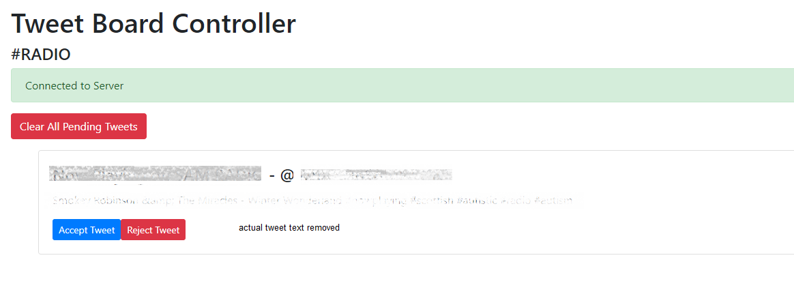

# Tweet Board

###### Michael Grace, 2020, 2022

## Starting

Required environment variables:

-   `TWITTER_CONSUMER_KEY`
-   `TWITTER_CONSUMER_SECRET`
-   `TWITTER_OAUTH_TOKEN`
-   `TWITTER_OAUTH_SECRET`
-   `HASHTAG` (this must include the `#` character)

## Accessing

-   The tweet wall can be accessed at `/`. Multiple clients can connect to this.
-   The controller can be accessed at `/control`. Only the latest controller to connect will be usable.

## Screenshots

